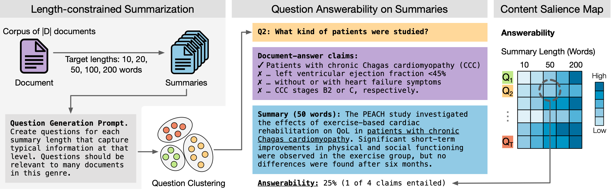

# Behavioral Analysis of Information Salience in Large Language Models

This repository provides the code, model outputs and annotations for following paper:

> Jan Trienes, Jörg Schlötterer, Junyi Jessy Li, Christin Seifert. 2025. [Behavioral Analysis of Information Salience in Large Language Models](). _arXiv Preprint_.

**Abstract.** Large Language Models (LLMs) excel at text summarization, a task that requires models to select content based on its importance. However, the exact notion of salience that LLMs have internalized remains unclear. To bridge this gap, we introduce an explainable framework to systematically derive and investigate information salience in LLMs through their summarization behavior. Using length-controlled summarization as a behavioral probe into the content selection process, and tracing the answerability of Questions Under Discussion throughout, we derive a proxy for how models prioritize information. Our experiments on 13 models across four datasets reveal that LLMs have a nuanced, hierarchical notion of salience, generally consistent across model families and sizes. While models show highly consistent behavior and hence salience patterns, this notion of salience cannot be accessed through introspection, and only weakly correlates with human perceptions of information salience.




## Computational Environment

We use the following Python environment for experimentation:

```sh
conda create -n info-salience python=3.11 pip
conda activate info-salience
pip install -r requirements-lock.txt
pip install -e .
pip install -r requirements-dev.txt
```

## Data

We experimented with four datasets:

1. **RCT.** Abstracts of randomized controlled clinical trials drawn from PubMed.
2. **Astro.** Discussion sections of astro-physics papers drawn from arXiv.
3. **CL.** Related work sections of NLP/Computational Linguistics papers drawn from arXiv.
4. **QMSum.** Meeting transcripts drawn from the QMSum dataset [(Zhong et al., NAACL 2021)](https://aclanthology.org/2021.naacl-main.472/)

The raw data for QMSum can be found in `data/raw/qmsum`, and most scripts should be able to run with this data. Also we provide scirpts to fetch a new sample of RCT abstracts from PubMed. Due to license terms, we cannot release the raw data for RCT, Astro, and CL. However, we are happy to assist anyone wanting to reproduce our experiments. Please reach out (see contact below).

### Preprocessing

```sh
# pubmed: fetch abstract from API and sample
python -m info_salience.preprocessing.pubmed
python -m info_salience.preprocessing.pubmed_sample

# QMSum
python -m info_salience.preprocessing.qmsum

# astro-ph
python -m info_salience.preprocessing.arxiv --raw_path data/raw/astro-ph --output_json data/processed/astro-ph/documents.json

# cs-cl
python -m info_salience.preprocessing.arxiv --raw_path data/raw/cs-cl --output_json data/processed/cs-cl/documents.json
```

Verify checksums of pre-processed data

```sh
md5sum data/processed/**/*
# 03654534b9f764f01ffb87e8f0565831  data/processed/astro-ph/documents.json
# 5423f77a10e979235b882bf2363f3d24  data/processed/cs-cl/documents.json
# bcd9c2bbd946060b1e2d5630cc46334f  data/processed/pubmed-sample/documents.json
# f3f9013d6ebf68ea055baf542c1090c0  data/processed/qmsum-generic/documents.json
# 38ad9f874a1b6637b8a9c8fb58349dfb  data/processed/qmsum-generic/metadata.json
```

## Experiments: Question-based Content Salience Analysis (`LLM-observed`)

Below is an example to run the pipeline on the `qmsum-generic` dataset. For a Slurm-based execution environment, please refer to [slurm.md](slurm.md).

**Step 0: summary generation**

```sh
# Baselines
python -m info_salience.summarization_baselines \
    --documents_json data/processed/qmsum-generic/documents.json \
    --output_path output/qmsum-generic/

# API-based models
python -m info_salience.summarization \
    --input_json data/processed/qmsum-generic/documents.json \
    --output_path output/qmsum-generic/gpt-4o-mini-2024-07-18/summaries/ \
    --model gpt-4o-mini-2024-07-18 \
    --prompt_name qmsum-generic \
    --engine litellm \
    --temperature 0.3 \
    --n_samples 5

# Local models (via vLLM)
python -m info_salience.summarization \
    --input_json data/processed/qmsum-generic/documents.json \
    --output_path output/qmsum-generic/Meta-Llama-3.1-8B-Instruct/summaries/ \
    --model meta-llama/Meta-Llama-3.1-8B-Instruct \
    --prompt_name qmsum-generic \
    --engine vllm \
    --temperature 0.3 \
    --n_samples 5
```

**Step 1 & 2: Question generation and Clustering**

Please refer to [`notebooks/20-qgen.ipynb`](notebooks/20-qgen.ipynb).

**Step 3: Question answering and claim decomposition**

```sh
python -m info_salience.qa \
    --documents_json data/processed/qmsum-generic/documents.json \
    --questions_json output/qmsum-generic/discord_questions.json \
    --answers_json output/qmsum-generic/discord_answers.json \
    --answer_facts_json output/qmsum-generic/discord_facts.json
```

**Step 4: answerability estimation**

Calculate answer claim entailment.

```sh
# Should be run for all generated summaries
python -m info_salience.claim_entailment \
    --facts_path output/qmsum-generic/discord_facts.json \
    --summaries_path output/qmsum-generic/Meta-Llama-3.1-8B-Instruct/summaries/temperature0.3-0.json
```

Afterwards, generate content salience map: [`notebooks/30-salience.ipynb`](notebooks/30-salience.ipynb)

## Experiments: Perceived Salience / Introspection (`LLM-perceived`)

```sh
python -m info_salience.introspection \
    --engine vllm \
    --model meta-llama/Meta-Llama-3.1-8B-Instruct
```

## Human perceived salience

We provide the interface for question salience annotation in [this repository](https://github.com/jantrienes/qa-salience-annotation), and a hosted version [here](https://jantrienes.com/qa-salience-annotation/?dataset=pubmed-sample&annotator=1234). Annotations can be found in `data/annotations/human-salience/<dataset>-<annotator_id>.json`. Here is a sample:

```json
{
  "dataset": "pubmed-sample",
  "annotator": "1gxc5yr",
  "comments": "",
  "items": [
    {
      "id": 6,
      "question": "What are the specific biological markers influenced by the intervention?",
      "rating": 3,
      "rationale": "Specific markers are useful, but are not essential in a summary so long as they represent a reasonable proxy for the underlying effect these markers are purported to explain."
    },
    ...
  ]
}
```

## Model outputs

Coming soon!

## Citation

If you found any of these resources useful, please consider citing the following paper.

```bibtex
@misc{Trienes:2025:arXiv,
    author = {
        Trienes, Jan and
        Schl{\"o}tterer, J{\"o}rg and
        Li, Junyi Jessy and
        Seifert, Christin
    },
    title = {Behavioral Analysis of Information Salience in Large Language Models},
    year = {2025},
    eprint = {},
    archiveprefix = {arXiv},
    primaryclass = {cs.CL},
    url = {https://arxiv.org/abs/}
}
```

## Licenses

Code: [MIT](LICENSE), Annotations: [CC-BY-4.0](data/infolossqa-v1.0/LICENSE).

## Contact

Please reach out to <a href="mailto:jan.trienes@uni-marburg.de">Jan Trienes</a> if you have any comments, questions, or suggestions.
